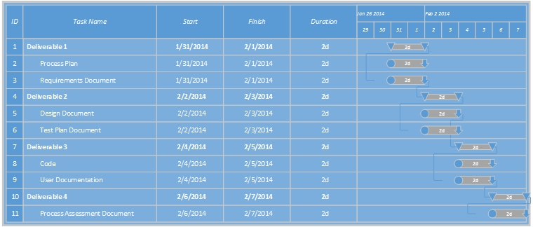

# Process Plan Document – Team 11

## 1 Introduction
The purpose of this project is to develop a software tool which tell the user the average number of words per sentence in an essay. The software is called <i>AverageSentenceLength</i>.  Its input is the path of a raw text file containing the essay to be analyzed.  It can also accept an optional list of characters used to demarcate sentence boundaries as well as the minimum number of letters a word must contain before it is counted to compute the average.  Defaults exist for both of these optional arguments.  The software will be simple, cross-platform, and user friendly.

### 1.1 Definitions and Acronyms

None.

## 2 Process Description

### 2.1 Project Lifecycle

For this project we are following a flexible waterfall model of software development.  By flexible we mean that the software and documents can be updated in later phases by mutual consent of the team's members.  The justification and history of later updates will be included in the documents themselves. Our process will include the following lifecycle phases.  

<b>Phase 1 -  Requirements Phase</b>

In this phase we will gather and document all requirements, both functional and technical, that the software must satisfy.

<b>Phase 2 - Design Phase</b>

In this phase we will design an application to satisfy the functional and technical requirements gathered and documented in Phase 1.

<b>Phase 3 - Development Phase</b>

In this phase we will write, document, and unit test the application.  

<b>Phase 4 - Test Phase</b>

In this phase someone other than the team member who designed or wrote the application will test it to verify that it satisfies the requirements gathered and documented in Phase 1.  Any defects found will be communicated to the Development Engineer via email.

<b>Phase 5 - Delivery Phase</b>

The application and documentation are delivered to the users.  

There will be no updates to the application so there is no maintenance phase (thus eliminating the most costly phase of most projects).

### 2.2 Process Activities

<b>A. Create Process Plan And Requirements Documents</b>

During the Requirements Specification Phase all team members will watch the project instructional videos and take notes.  The Methodology Engineer and Requirements Engineer will create the Process Plan and Requirements Documents and share them with the team via GitHub by the documents' draft deadline.  Other team members will have twenty-four hours to review the documents in GitHub and make changes and additions.  After twenty-four hours for review, the Requirements Engineer will run "git show" and complete the corresponding deliverable's quiz on Udacity.  The Process Plan Document is an input to all other phases and the Requirements Document is an input to the Design, Development, and Test Phases.

<b>B. Create Design And Test Plan Documents</b>

During the Design Phase the Design Engineer will create the Design and Test Plan Documents after reviewing the Requirements Document.  The Design Engineer will share them with the team via GitHub by the documents' draft deadline.  Other team members will have twenty-four hours to review the documents in GitHub and make changes and additions.  After twenty-four hours for review, the Design Engineer will run "git show" and complete the corresponding deliverable's quiz on Udacity. The Design Document is an input to the Development Phase.  The Test Plan Document is an input to the Test Phase.  

<b>C. Write The Application And Unit Test It</b>

During the Development Phase the Development Engineer and Documentationist will write the application, its unit tests, and its user documentation.  The Development Engineer will share them with the team via GitHub by their draft deadline.  Other team members will have twenty-four hours to review them in GitHub and make changes and additions.  The application and user documentation are inputs to the Test and Delivery Phases.  

<b>D. Test The Application</b>

During the Test Phase the Test Engineer will test the application and review its user documentation.  The Test Engineer will communicate all defects to the Development Enginneer via email within twenty hours of the application code and user documentations' draft deadline.  The Development Engineer will fix all defects in the application code and user documentation by their final deadline.  The Development Engineer will then run "git show" and complete the corresponding deliverable's quiz on Udacity.

<b>E. Deliver The Application</b>

During the Delivery Phase all team members will update the project's deliverables as necessary before the final deadline on Friday, February 7th, at 11:55 PM PST.

## 3 Team and Roles

### 3.1 Team Members

<ul>
	<li>John Reed</li>
	<li>Justin Stringer</li>
	<li>Raymond Navarro</li>
	<li>Vikram Singh</li>
</ul>

### 3.2 Role Descriptions

<table>
<tbody>
	<tr>
		<td><b>Role</b></td>
		<td><b>Responsibility</b></td>
	</tr>

	<tr>
		<td>Requirements Engineer</td>
		<td>Gathers and documents application requirements.</td>
	</tr>
	<tr>
		<td>Design Engineer</td>
		<td>Designs the application to satisfy the requirements.</td>
	</tr>
	<tr>
		<td>Development Engineer</td>
		<td>Develops the application according to the design.</td>
	</tr>
	<tr>
		<td>Test Engineer</td>
		<td>Tests the application to verify that it satisfies all requirements.</td>
	</tr>
	<tr>
		<td>Project Manager</td>
		<td>Enables the team and notifies management of the project's status.</td>
	</tr>
	<tr>
		<td>Methodology Engineer</td>
		<td>Works with all other team members to make sure that the project's software design process is followed and that all deliverables are correctly and consistenly completed.</td>
	</tr>
	<tr>
		<td>Documentationist</td>
		<td>Documents the application for the end user.</td>
	</tr>
	<tr>
	</tbody>
</table>

### 3.3 Role Assignments

<table>
<tbody>
	<tr>
		<td><b>Role</b></td>
		<td><b>Team member(s)</b></td>
	</tr>
	<tr>
		<td>Requirements Engineer</td>
		<td>Vikram Singh</td>
	</tr>
	<tr>
		<td>Design Engineer</td>
		<td>John Reed</td>
	</tr>
	<tr>
		<td>Development Engineer</td>
		<td>Justin Stringer</td>
	</tr>
	<tr>
		<td>Test Engineer</td>
		<td>Raymond Navarro</td>
	</tr>
	<tr>
		<td>Project Manager</td>
		<td>Justin Stringer</td>
	</tr>
	<tr>
		<td>Documentationist</td>
		<td>Justin Stringer</td>
	</tr>
	<tr>
		<td>Methodology Engineer</td>
		<td>Vikram Singh</td>
	</tr>
	<tr>
		<td>Methodology Engineer</td>
		<td>Raymond Navarro</td>
	</tr>
</tbody>
</table>

## 4 Estimated Effort and Planned Schedule

### 4.1 Estimate Effort

<table>
<tbody>
	<tr>
		<td><b>ACTIVITY</b></td>
		<td><b>NUMBER OF HOURS</b></td>
	</tr>
	<tr>
		<td>500 lines of documented code.</td>
		<td>5 hours</td>
	</tr>
	<tr>
		<td>500 lines of documented developer tests in Junit.</td>
		<td>5 hours</td>
	</tr>
	<tr>
		<td>1 iteration of testing and defect fixes.</td>
		<td>3 hours</td>
	</tr>
	<tr>
		<td>1 page of user documentation.</td>
		<td>2 hour</td>
	</tr>
	<tr>
		<td>4 other process related deliverables.</td>
		<td>20 hours</td>
	</tr>
	<tr>
		<td>4 online meetings and email exchanges.</td>
		<td>6 hours</td>
	</tr>
	<tr>
		<td><b><i>Total</i></b></td>
		<td><b><i>41 hours</i></b></td>
	</tr>
</table>
</tbody>

### 4.2 Planned Schedule

The project schedule is governed by the below deadlines.

<table>
<tbody>
	<tr>
		<td><b>DELIVERABLE #</b></td>
		<td><b>DELIVERABLE NAME</b></td>
		<td><b>INITIAL DRAFT DUE DATE</b></td>
		<td><b>FINAL DRAFT DUE DATE</b></td>
	</tr>
	<tr>
		<td>Deliverable 1</td>
		<td>Process Plan Document</td>
		<td>Sunday 2/2 9PM EST</td>
		<td>Monday 2/3 9PM EST</td>
	</tr>
	<tr>
		<td>Deliverable 1</td>
		<td>Requirements Document</td>
		<td>Sunday 2/2 9PM EST</td>
		<td>Monday 2/3 9PM EST</td>
	</tr>
	<tr>
		<td>Deliverable 2</td>
		<td>Design Document</td>
		<td>Tuesday 2/4 9PM EST</td>
		<td>Wednesday 2/5 9PM EST</td>
	</tr>
	<tr>
		<td>Deliverable 2</td>
		<td>Test Plan Document</td>
		<td>Tuesday 2/4 9PM EST</td>
		<td>Wednesday 2/5 9PM EST</td>
	</tr>
	<tr>
		<td>Deliverable 3</td>
		<td>Application Code</td>
		<td>Wednesday 2/5 9PM EST</td>
		<td>Thursday 2/6 9PM EST</td>
	</tr>
	<tr>
		<td>Deliverable 3</td>
		<td>User Documentation</td>
		<td>Wednesday 2/5 9PM EST</td>
		<td>Thursday 2/6 9PM EST</td>
	</tr>
	<tr>
		<td>Deliverable 4</td>
		<td>Process Assessment Document</td>
		<td>Wednesday 2/5 9PM EST</td>
		<td>Thursday 2/6 9PM EST</td>
	</tr>
</tbody>
</table>

<table>
<tbody>
	<tr>
		<td><b>FINAL PROJECT DEADLINE</b></td>
	</tr>
	<tr>
		<td>Friday 2/7 11:55PM PST</td>
	</tr>
</tbody>
</table>

 
